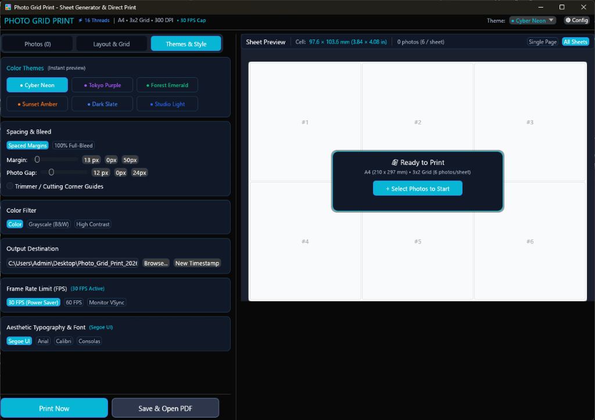
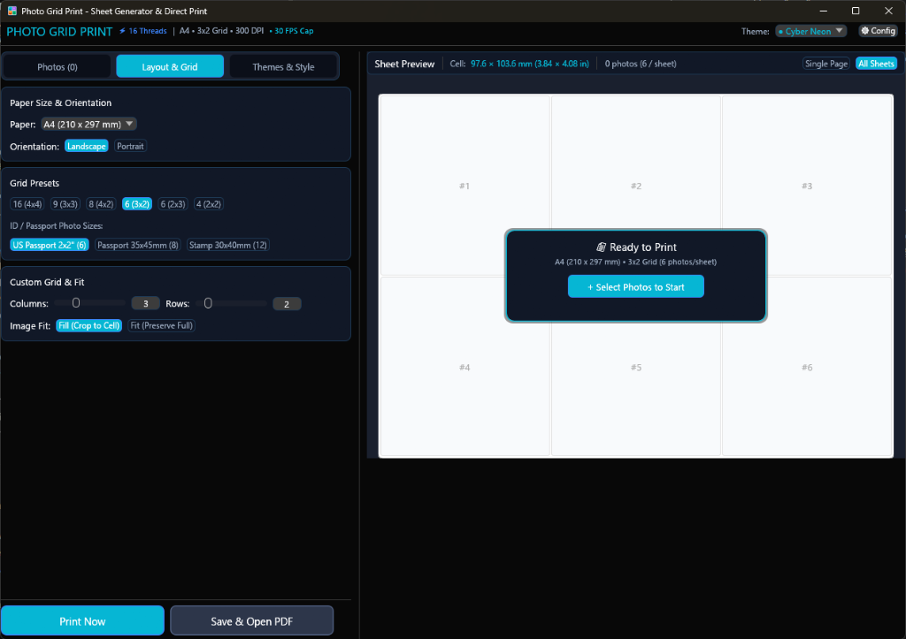
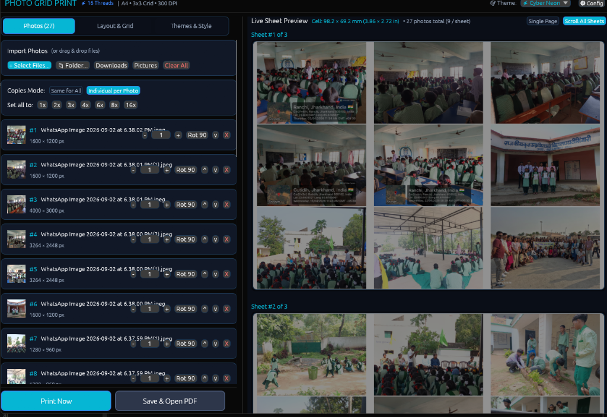

#  Photo Grid Print

<p align="center">
  
  
  
  
  
  
</p>

A blazing-fast, standalone desktop studio workbench and **native Android mobile app** that arranges photos into multi-page print-ready grid sheets in **300 DPI PDF format** with **Realistic Paper Canvas**, **Live Multi-Sheet Preview**, **Interactive Drag-and-Drop Reordering**, **Passport & ID Presets**, **Automatic Timestamped PDF Exports**, **30 FPS Power-Saver Frame Limiter**, **Aesthetic Typography**, and **Direct Printing**.

---

## 📸 Screenshots Showcase

### 🎨 Themes, Style & Studio Paper Canvas
<p align="center">
  
</p>

### 📐 Layout, Grid & Passport Photo Presets
<p align="center">
  
</p>

### 🖼️ Live Multi-Sheet Preview & Interactive Photo Editing
<p align="center">
  
</p>

---

## ⚡ Highlights & Key Features

### 🖥️ Studio Workbench GUI (Windows / Linux / macOS)
* **📄 Realistic Physical Paper Sheet Canvas**:
  * The canvas immediately renders an authentic white physical paper sheet with realistic soft drop shadows and true physical aspect ratio for your chosen paper.
  * Numbered live grid cell outlines (`#1`, `#2`, `#3`...) update in real time as you adjust columns, rows, or presets before loading photos.
  * Hovering over photos highlights them with clean borders **without dimming or washing out your photos**.
* **🖐️ Interactive Drag-and-Drop Reordering**:
  * Reorder photos directly on the live sheet canvas with mouse drag-and-drop.
  * In the photo manager sidebar, each photo card features individual `[-] 1 [+]` copies steppers, `Rot 90` quick rotation, `^` / `v` reorder buttons, and delete actions.
* **📅 Collision-Free Timestamped PDF Exports**:
  * Automatically appends date and time to every export: `Photo_Grid_Print_YYYYMMDD_HHMMSS.pdf`.
  * Multiple generated files can exist side-by-side on your desktop without overwriting prior prints.
  * Includes a single-click **`New Timestamp`** button to refresh filenames anytime.
* **⚡ 30 FPS Power-Saver Frame Rate Limiter**:
  * Paced to **33.3 ms per frame (~30 FPS)** during active dragging, scrolling, and interaction, cutting CPU and GPU energy usage by up to **75%** on 120Hz/144Hz displays.
  * Automatically sleeps at **0 FPS / 0% CPU** when idle.
  * Configurable in *Themes & Style*: choose **30 FPS (Power Saver)**, **60 FPS**, or **Monitor VSync**.
* **✨ Aesthetic Modern Typography Engine**:
  * Integrated **Windows Segoe UI** + **Segoe UI Symbol** for razor-sharp Fluent Design typography and native symbol rendering.
  * Choose between **Segoe UI (Fluent Modern)**, **Arial (Clean)**, **Calibri (Soft Elegant)**, or **Consolas (Studio Mono)**.
  * Zero missing glyph boxes (`▯`) anywhere in the application.
* **🎨 6 Designer Color Themes**:
  * `● Cyber Neon` (Electric Cyan & Midnight Slate)
  * `● Tokyo Purple` (Synthwave Violet)
  * `● Forest Emerald` (Radiant Pine)
  * `● Sunset Amber` (Warm Coral & Amber)
  * `● Dark Slate` (Obsidian Studio Slate)
  * `● Studio Light` (Clean Paper Workspace)
* **📐 Passport & ID Photo Presets**:
  * **US Passport 2x2"** ($51 \times 51\text{ mm}$)
  * **Passport 35x45mm** (Schengen, India, UK)
  * **Stamp / ID 30x40mm**
  * Grid Presets: `16 (4x4)`, `9 (3x3)`, `8 (4x2)`, `6 (3x2)`, `6 (2x3)`, `4 (2x2)`.
* **📐 Paper Sizes, Margins & Trimmer Marks**:
  * Supports **A4**, **US Letter**, **US Legal**, **4x6" Photo**, **5x7" Photo**, **A3**, and **A5**.
  * Spaced margins or **100% Full-Bleed borderless printing**.
  * Optional **Trimmer / Cutting Corner Guides** for guillotine or scissor cutting.
* **🖨️ Direct Printing & PDF Generator**:
  * **Print Now**: Direct printer routing via native Windows print spooler.
  * **Save & Open PDF**: Outputs publication-quality **300 DPI** multi-page PDF documents.

---

### 📱 Android Mobile App (`PhotoGridPrint-Android.apk`)
* **100% Native Jetpack Compose Architecture**.
* **Touch Drag-and-Drop Reordering**: Long-press any photo on the live preview canvas to float and drop it into a new position.
* **Multi-Page Sheet Navigation**: `< Prev` and `Next >` sheet carousel.
* **Timestamped PDF Saving**: Saves directly to Android `Documents/PhotoGridPrint/Photo_Grid_Print_YYYYMMDD_HHMMSS.pdf`.
* **Direct Android Print Spooler**: Print wirelessly via Wi-Fi/Mopria printers right from your phone or tablet.

---

## 🚀 Installation & Download

### 1. Pre-built Binaries
* **Desktop (Windows x64 / ARM64, Linux, macOS)**:
  Download the latest executable from [GitHub Releases](https://github.com/sidhantjohnaind/photo_grid_print/releases).
* **Android (Phone / Tablet)**:
  Download **`PhotoGridPrint-Android.apk`** from [GitHub Releases](https://github.com/sidhantjohnaind/photo_grid_print/releases) and install directly on your device.

---

### 2. Build Desktop from Source (Rust)

```bash
# Clone the repository
git clone https://github.com/sidhantjohnaind/photo_grid_print.git
cd photo_grid_print

# Build optimized release binary
cargo build --release

# Run
./target/release/photo_grid_print.exe
```

---

### 3. Build Android APK from Source

```bash
cd android
./gradlew assembleRelease
# Output APK: android/app/build/outputs/apk/release/app-release.apk
```

---

## 💻 CLI Usage

You can also run Photo Grid Print directly from the terminal or in automated scripts:

```bash
# Generate a 4x4 sheet from a folder of photos
photo_grid_print --input "C:\Photos\Album" --cols 4 --rows 4 --paper a4

# Generate 6-photo (3x2) passport batch with 2 copies each and auto-print
photo_grid_print --input "C:\Photos\ID.jpg" --cols 3 --rows 2 --copies 2 --print
```

---

## 🛠️ Configuration File

Settings are saved automatically in:
* **Windows**: `%APPDATA%\PhotoGridPrint\config.json`
* **Linux / macOS**: `~/.config/PhotoGridPrint/config.json`

---

## 📜 License

Licensed under the [MIT License](LICENSE).
